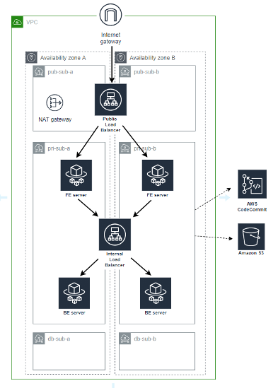

# ansible-demo
Ansible exercise

Logical Diagram: 




Create the following:
```
All on Tokyo region
1 VPC
1 internet gateway associated to the VPC
1 NAT gateway, in the public subnet
VPC endpoint for Amazon S3
2 public subnets (default route to internet gateway)
2 private subnet (default route to NAT gateway)
2 DB subnet (only local, no default route)
1 bastion instance on Public Subnet
	Ubuntu 20.04 AMI
	1 Public Load balancer (and target group) for the Frontend ASG
1 Internal Load balancer (and target group) for the Backend ASG
Necessary security groups for the instances/ALB
```
Required Notes:
```
Create S3 bucket that contains zip files:
frontend.zip (This file should contain test index.html files, etc.) – for frontend servers
backend.zip (This file should contain test index.html files, etc.) – for backend servers
The public load balancer should be in the public subnets, Listener is port 80
The internal load balancer should be in the private subnets, Listener is port 80
Load balancer Listener port 80 should be accessible only on you IP
Create two ASG – Frontend group and Backend group (count 1)
The Frontend and Backend server groups should be in the private subnets and assigned to respective load balancers.
Assign an IAM role to the EC2 servers to have AmazonS3ReadOnlyAccess and AmazonEC2ReadOnlyAccess.
```

Additional tags to Bastion Server:

    ansible_role = stg-bastion-apne1

Addtional tags for the FE Servers

    ansible_role = stg-frontend-apne1

Addtional tags for the BE Servers

    ansible_role = stg-backend-apne1

Create a “common” ansible role that will do the following:
- run the apt-get update and apt-get upgrade to update the OS
- update the SSHD config file to have a custom port in the config (make sure to keep the original as backup)
- restart sshd
- copy a custom logrotate file into the /etc/logrorate.d/ folder (any sample config will do)
- install the following packages:
        wget
        unzip
        curl
        python-dev
        python-pip
        git 
        jq
        sysstat
- create a "ansible-user" system user account on all instances with sudo permission
- create normal users: kenneth, amiel, carl, darwin, john, paul, richmond, test
- set /etc/shadow file permission to 0400
- set the /var/log/syslog file permission to 0600


Create a frontend ansible role that will do the following:
- install the packages:
	apache2
mysql-client
	php
- create a folder /tmp/fefiles
- download the frontend.zip file from the S3 bucket to /tmp/datafiles
- extract the frontend.zip file to the /var/www/html/ folder
- update the index.html file to add: “My Private IP address is: xx.xx.xx.xx”
- start the apache service
- ensure that the apache service is enabled on startup. 
	- delete the folder /tmp/fefiles
	- delete the user “test”
Create a backend ansible role that will do the following:
- install the packages:
	apache2
	mysql-client
	mysql-server
	php
	openjdk
- create a folder /tmp/befiles
- download the backend.zip file from the S3 bucket to /tmp/datafiles
- extract the backend.zip file to the /var/www/html/ folder
- start the apache service
- ensure that the apache service is enabled on startup. 
	- delete the folder /tmp/befiles
	- delete the user “test”

Create a “master” playbook that will call the three roles: 
-	common role (run on all servers)
-	frontend role (run only when target is frontend server) 
-	backend role (run only when target is backend server) 
** use EC2 ansible-role tags to determine either front-end or backend (see user data section)

